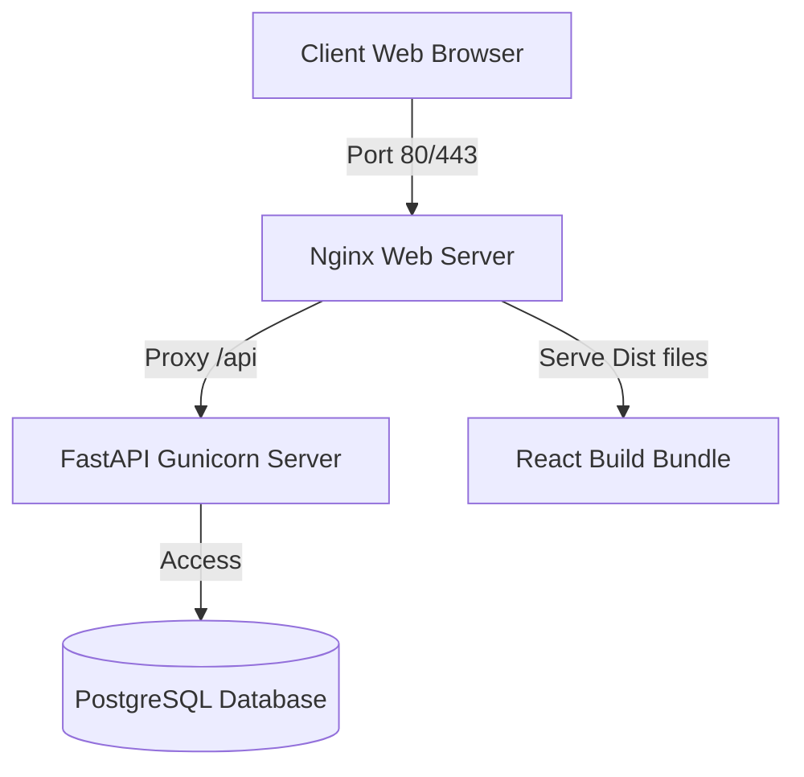

# Deployment & Testing Guide - MarketMind AI

This guide explains how to deploy MarketMind AI in production, execute automated tests, and manage database backups.

---

## 1. Production Deployment

The application is deployed using Docker Compose to orchestrate independent frontend, backend, database, and proxy services.



### 1.1 Step-by-Step Setup
1. Clone the project code to your production host.
2. Generate secure passwords and secret keys:
   ```bash
   # Create production env
   cp .env.example .env
   ```
3. Edit the `.env` file to set:
   * `SECRET_KEY`: A secure 32-character string.
   * `GEMINI_API_KEY`: Your vision-enabled API credential.
   * `POSTGRES_PASSWORD` (if customized).
4. Run Docker Compose in detached daemon mode:
   ```bash
   docker-compose up -d --build
   ```
5. Confirm containers are active:
   ```bash
   docker-compose ps
   ```

### 1.2 Nginx Security Hardening
In production, configure SSL certificates (e.g., Let's Encrypt) to enforce secure HTTPS connections:
* Mount certificates inside Nginx container volumes.
* Add port 443 listeners redirecting port 80 traffic to SSL.

---

## 2. Backup Strategy

### 2.1 Automated PostgreSQL Backup
Create a shell script (`backup.sh`) on your host cron job calendar:

```bash
#!/bin/bash
BACKUP_DIR="/var/backups/marketmind"
TIMESTAMP=$(date +%F_%T)
mkdir -p "$BACKUP_DIR"

# Execute pg_dump inside database container
docker exec -t marketmind_db pg_dump -U postgres marketmind > "$BACKUP_DIR/backup_$TIMESTAMP.sql"

# Remove backups older than 30 days
find "$BACKUP_DIR" -type f -mtime +30 -delete
```

Set this script to run daily at midnight via a crontab entry:
```text
0 0 * * * /bin/bash /path/to/backup.sh
```

---

## 3. Automated Testing Guide

Automated unit tests ensure calculator models and authentication tokens function correctly.

### 3.1 Setup Test Environment
Ensure testing dependencies (e.g., `pytest`, `httpx`) are installed:
```bash
cd backend
pip install -r requirements.txt
```

### 3.2 Running the Test Suite
Run the following command to execute all backend tests:
```bash
pytest -v
```
Test results will confirm in-memory database setups, token validation limits, and edge calculations are valid.
