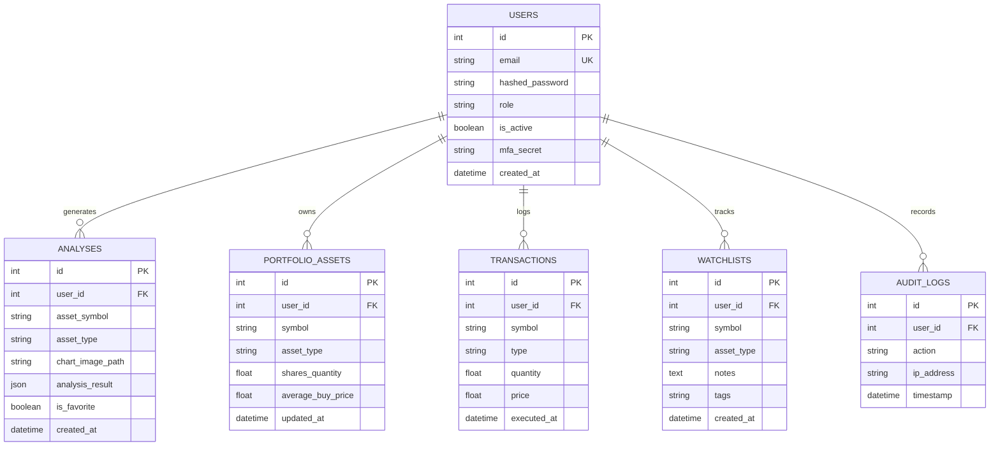

# System Design & Architecture Document - MarketMind AI

## 1. Architectural Style
MarketMind AI uses a containerized multi-tier client-server architecture:
* **Presentation Layer**: Single Page Application built on React, TypeScript, and Tailwind CSS. Renders dashboards, charts, forms, and handles state.
* **API Gateway / Control Layer**: FastAPI (Python) implementing REST API routes, security middleware, and input parsing.
* **Service Integrations**: Google Gemini API for Vision Technical analysis, and Yahoo Finance/Binance APIs for live price feeds.
* **Data Layer**: PostgreSQL (development/production) or SQLite (local standalone) with SQLAlchemy Object Relational Mapping (ORM).

---

## 2. Entity Relationship Diagram (ERD)

---

## 3. Database Schema Mapping

### 3.1 `users` Table
* `id` (INTEGER, Primary Key, Auto-increment)
* `email` (VARCHAR, Unique, Indexed, Not Null)
* `hashed_password` (VARCHAR, Not Null)
* `role` (VARCHAR, Default 'retail', Not Null)
* `is_active` (BOOLEAN, Default True, Not Null)
* `mfa_secret` (VARCHAR, Nullable)
* `created_at` (DATETIME, Default UTC Now, Not Null)

### 3.2 `analyses` Table
* `id` (INTEGER, Primary Key, Auto-increment)
* `user_id` (INTEGER, Foreign Key referencing `users.id`, Not Null)
* `asset_symbol` (VARCHAR, Not Null)
* `asset_type` (VARCHAR, Not Null)
* `chart_image_path` (VARCHAR, Nullable)
* `analysis_result` (JSON, Not Null)
* `is_favorite` (BOOLEAN, Default False, Not Null)
* `created_at` (DATETIME, Default UTC Now, Not Null)

### 3.3 `portfolio_assets` Table
* `id` (INTEGER, Primary Key, Auto-increment)
* `user_id` (INTEGER, Foreign Key referencing `users.id`, Not Null)
* `symbol` (VARCHAR, Not Null)
* `asset_type` (VARCHAR, Not Null)
* `shares_quantity` (FLOAT, Default 0.0, Not Null)
* `average_buy_price` (FLOAT, Default 0.0, Not Null)
* `updated_at` (DATETIME, Default UTC Now, Not Null)

### 3.4 `transactions` Table
* `id` (INTEGER, Primary Key, Auto-increment)
* `user_id` (INTEGER, Foreign Key referencing `users.id`, Not Null)
* `symbol` (VARCHAR, Not Null)
* `type` (VARCHAR, Not Null) - "BUY" or "SELL"
* `quantity` (FLOAT, Not Null)
* `price` (FLOAT, Not Null)
* `executed_at` (DATETIME, Default UTC Now, Not Null)

### 3.5 `watchlists` Table
* `id` (INTEGER, Primary Key, Auto-increment)
* `user_id` (INTEGER, Foreign Key referencing `users.id`, Not Null)
* `symbol` (VARCHAR, Not Null)
* `asset_type` (VARCHAR, Not Null)
* `notes` (TEXT, Nullable)
* `tags` (VARCHAR, Nullable)
* `created_at` (DATETIME, Default UTC Now, Not Null)

### 3.6 `audit_logs` Table
* `id` (INTEGER, Primary Key, Auto-increment)
* `user_id` (INTEGER, Foreign Key referencing `users.id`, Nullable)
* `action` (VARCHAR, Not Null)
* `ip_address` (VARCHAR, Nullable)
* `timestamp` (DATETIME, Default UTC Now, Not Null)
